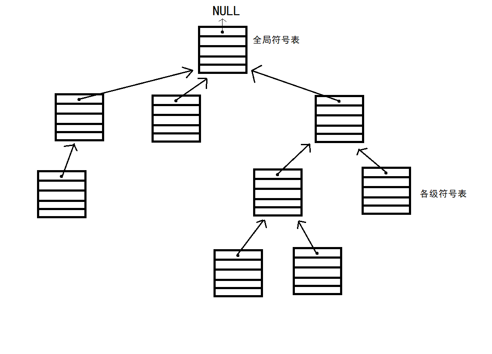

# <center>编译技术申优文档</center>

<center>18375200 刘裕炜</center>

## 一、词法分析

词法分析是编译的前端过程中最简单的一部分。它将散乱的字符串流封装为固定的符号串。主要实现方法为按最长匹配的方式识别各种标识符。主要需要关注下面几个问题。

#### 去除注释

先将整个代码扫描一遍，将所有`//`及其到行尾之间的内容，以及所有`/*`和`*/`之间的内容均替换为空格。此步去除所有注释内容。

需要注意的是，不是所有的`//`和`/*...*/`都应该被识别为注释。首先需要注意同一行多个注释起始符的情况，只能有一个生效。比如：

```c
// /* ......
```

这样的注释需要忽略后面的起始符。

此外，字符串的存在也影响注释的识别。若在字符串内出现了注释的起始符号，需要忽略它，仅仅当作字符串的一部分。

#### Token识别

词法分析过程中，需要遵循最长匹配原则，因此不能简单鲁莽地读入然后识别，需要考虑各标识符的结构。因此将38种Token作如下分类：

* 单字符类

| `+`  | `-`  | `*`  | `/`  | `%`  | `;`  | `,`  |
| ---- | ---- | ---- | ---- | ---- | ---- | ---- |
| `(`  | `)`  | `[`  | `]`  | `{`  | `}`  |      |

该类共13种Token，每种Token均不为其它任一中Token的前缀。因此，在词法分析程序遇到该类字符时，立刻可以将其识别为相应的Token类型。

* 双字符及其前缀类

| `!`  | `>`  | `<`  | `=`  | `&`  | `|`  |
| ---- | ---- | ---- | ---- | ---- | ---- |
| `!=` | `>=` | `<=` | `==` | `&&` | `||` |

该类共6对，12种Token。可以看出，首行每个Token都是次行相应Token的前缀，因此在读取到首行的字符时，需要再尝试读取一次后面紧接着的一个字符，以确定它是单个出现还是和后面紧跟着的符号一起构成一个Token。

* 格式字符串**FormatString**

以`"`开头，以`"`结尾的字符串。在读取到一个`"`时，直接向后查找到下一个`"`字符或文件结尾。若找到下一个`"`，则两个`"`及它们之间的所有内容为一个格式字符串。若找不到，则显然有双引号不匹配，抛出错误。

* 整常数**IntConst**

全为数字的字符串。判断方法为在开头读取到一个数字字符后，将所有连续的数字字符均算入。

* 标识符和英文保留字

在排除以上所有情况之后，若读取到一个`a`-`z`，或`A`-`Z`或`-`，则一路向后读取所有`a`-`z`，`A`-`Z`，`0`-`9`或`-`。此类标识符在确定其内容后，再去尝试匹配各个英文保留字，若均无法匹配，则认为是一个标识符。

#### 特殊处理

词法分析可以为后面的内容提前做好准备，比如在我的设计中，词法分析同时完成了格式字符串的格式识别，方便格式字符串的错误处理和代码生成时的翻译。

在我的设计中，词法分析作为单独的一个过程，产生一列Token流供后续处理，有利于后面语法分析的回溯，且解耦了词法分析和语法分析，方便分别进行修改。

## 二、语法分析

语法分析的主要架构是基于递归下降流程的。我设立了一个整体的语法类，并且将词法分析中的Token设置为该语法类的子类，实现Token和其它语法结构的统一管理。语法分析部分语法类结构如下：

```java
public class SyntaxClass {
    private int lineNo;
    private int syntaxType;
    private ArrayList<SyntaxClass> sonNodeList;
    
    // ...
}
```

主要属性有其行号、对应的语法成分类型，以及其在推导中下一步推导得出的所有符号列表。

#### 实现流程特点

我的语法分析部分有一些特点可以说明。

通过尽可能地拆分文法内多个可选成分以尽可能减少回溯，如在成分`Stmt`推导时，检测下一个`Token`的情况，若为`if`则直接转对if语句读取，若为`return`则转对return语句读取，若为`printf`则转对printf语句读取等。

但这样无法完全避免回溯，在需要回溯的地方通过抛出错误来上溯到负责回溯的那一层，然后该层丢弃当前结果，复位读取位置，重新尝试读取。

对于部分左递归文法，如各种表达式，改写为非递归文法以避免死循环。但是将左递归文法改写为非递归文法后，按改写的文法执行递归下降，建立的语法树等价但不符合输出要求。如5个式子连乘，要求的文法需要做成高度为6的二叉树，但修改文法后可以做到两层的多叉树，这导致输出时结构与期待结构有差异，因此需要重新在树中建立左递归的结构。解决方案是在处理左递归时先按照改写文法处理，但在发现右侧还有成分时，先将左侧向上打包一层，构造出原文法所要求的左递归结构。

递归下降过程是较为枯燥的重复性过程，大部分内容可以简单解决，只有少部分回溯需要着重考虑。最终，我的程序输出一个语法类对象，对应的类型为`compUnit`，即抽象语法树的根节点。逐层展开则可以得到完整的推导过程。

## 三、错误处理

错误处理部分，符号表系统是重点。我参考了*Compilers: Principles, Techniques and Tools*一书，我设计了单向树结构的符号表，每一级一张独立的符号表，其`parent`指向其直接上一级符号表。全局符号表的`parent`指向`null`。



如此设计可以保证每次在一张符号表上能且只能看见该符号表本身及所有该符号表从属的符号表，看不见与其没有直接隶属关系的符号表。且在递归下降分析时，这类单向树符号表的行为与栈类似，能很好适应递归下降时的符号表操作。但其能够在该过程结束后，进入翻译环节还能继续使用，而不是像栈式符号表一样使用完就被擦除覆写。

在加入符号时，符号表仅扫描本表内是否有重名变量。在查找符号时，从本级开始逐级向上查找，找到最近的一个即可。这就满足了内部符号覆盖外部符号的要求。

#### 错误处理实现

| 错误类型 | 处理实现 |
| -------- | -------- |
| 非法符号 | 词法分析时检测到`FormatString`时就检测是否有非法字符，若有，则将错误加入错误列表。 |
|名字重定义|检测到当前是定义类型的语法成分时，将相应Token的内容在当前符号表内查询，若查询到有效记录则报错。|
|未定义名字|在`LVal`和`UnaryExp`检测到标识符时，在当前符号表要求全局查询，若查找不到则报错。|
|函数参数个数不匹配|在检查到函数调用时，确认函数符号有效及函数内各参数有效后，生成函数调用参量类型表，调用被调函数的符号的检查模块，检查参数个数是否匹配。|
|函数参数类型不匹配|完成参数个数检测且未报错后，调用被调函数的符号的检查模块，检查参数类型是否匹配。|
|无返回值函数存在不匹配return语句|检查到当前语句为return，则从符号表检查当前所在函数类型，然后与return类型比较，若不匹配，则报错。|
|有返回值函数缺少return语句|在执行完一次对`FuncDef`的读取后，若该函数为有返回值函数，则检查`Block`的最后一项语法成分是否为return语句。|
|改变`LVal`常量值|检查到对`LVal`赋值的语句，则去符号表中检查该`LVal`对应的Token，若为常量则报错。|
|缺少分号|递归下降检查时若在该出现分号时没有分号则报错。|
|缺少右小括号|递归下降检查时若在该出现右小括号时没有右小括号则报错。|
|缺少右中括号|递归下降检查时若在该出现右中括号时没有右中括号则报错。|
|printf中格式字符与表达式个数不匹配|在词法分析时就检查格式字符串中格式字符数，在读取到printf时检查后面表达式的数量是否与格式字符数匹配。|
|非循环块中使用break或continue|检查到break或continue时，在符号表中检查当前是否在循环块内，若不在则报错。|

在存在回溯的递归下降部分，若简单地在产生错误处直接进行处理，会导致回溯后多次报告同一错误，因此在对如`LVal`等部分进行错误处理时，不再直接处理，而是记录错误情况，作为`Exception`抛出，交给上一层逻辑判断是否将本次报错加入已检测的错误列表。

某些部分如缺括号、缺分号之类进行错误处理后，后面的内容会因为检测不到前一处应有的符号而报错，因此在报错的错误处理部分把缺失的符号补回去了。

但是需要注意的是，程序中变量的作用域是从定义点开始向后有效。对于定义点之前的变量使用，需要向上一级查找。因此，在查询符号表，特别是已经建立好的完整的符号表的时候，不可以简单地向该层申请查询。例如对于如下的情况：

```c
int main() {
	int a = 100;
    {
        {
            int b = a + 1; // 此处需要查询a
            a = 10086;
        }
        a = 114514;
    }
}
```

在处理注释所在行时，需要在符号表中查询a。若不加以限制地从本级开始递归向上查询，会得到a的值为10086，显然是错误的。因此，查询时需要加上本级的位置。

但仅仅加上本级位置是不够的，它可以绕开本级定义，向上一级查询。但向上一级符号表查询时，没有说明从上一级符号表的何处查询，仍会查询到后面定义的`a = 114514`。因此，在每次新建符号表时，需要记录该符号表对应的执行环境位于上一级执行环境的什么位置。

## 四、代码生成

代码生成分为两个阶段，中间代码生成和目标代码生成。先讨论中间代码生成环节。

中间代码生成阶段接受语法分析和错误处理阶段得到的抽象语法树和对应的符号表系统，然后生成类似“四元式”的中间代码。我的中间代码设计如下：

#### 算术指令（允许立即数）

| 指令                             | 用途               |
| -------------------------------- | ------------------ |
| add \<dest\> \<op1\> \<op2\>     | op1 + op2          |
| minu \<dest\> \<op1\> \<op2\>    | op1 - op2          |
| mult \<dest\> \<op1\> \<op2\>    | op1 * op2          |
| div \<dest\> \<op1\> \<op2\>     | op1 / op2（整除）  |
| mod \<dest\> \<op1\> \<op2\>     | op1 % op2（取模）  |
| assign  \<dest\> \<op1\>         | dest = op1（赋值） |
| lshift \<dest\> \<op1\> \<op2\>  | op1 << op2         |
| rshift \<dest\> \<op1\> \<op2\>  | op1 >> op2，逻辑   |
| rashift \<dest\> \<op1\> \<op2\> | op1 >> op2，算术   |
| and \<dest\> \<op1\> \<op2\>     | op1 & op2          |

#### 逻辑指令

| 指令                          | 用途       |
| ----------------------------- | ---------- |
| gre  \<dest\> \<op1\> \<op2\> | op1 > op2  |
| geq  \<dest\> \<op1\> \<op2\> | op1 >= op2 |
| lss  \<dest\> \<op1\> \<op2\> | op1 < op2  |
| leq  \<dest\> \<op1\> \<op2\> | op1 <= op2 |
| eql  \<dest\> \<op1\> \<op2\> | op1 == op2 |
| neq  \<dest\> \<op1\> \<op2\> | op1 != op2 |

#### 控制流

| 指令                               | 用途                                                         |
| ---------------------------------- | ------------------------------------------------------------ |
| br \<label\>                       | 无条件跳转至 \<label\>（op3）                                |
| bz \<label\> \<op1\>               | 若op1为0则跳转至\<label\>（op3）                             |
| bnz \<label\> \<op1\>              | 若op1不为0则跳转至\<label\>（op3）                           |
| call \<ret\> \<func> \<ParamList\> | 返回值（op3，可为null），函数调用（op1），带参数列表（可空） |
| setret \<op3\>                     | 设置为返回值                                                 |
| ret                                | 函数返回                                                     |
| exit                               | main函数结束，程序结束                                       |

#### 内存操作

| 指令                          | 用途                                         |
| ----------------------------- | -------------------------------------------- |
| load \<op3\> \<op1\> \<op2\>  | 从op1为基地址，op2为偏移量处取值送op3        |
| store \<op3\> \<op1\> \<op2\> | 向op1为基地址，op2为偏移量处存op3            |
| alloca \<dest\> \<op1\>       | 开辟op1字节大小空间，基地址送dest（int需*4） |

#### 输入输出

| 指令               | 用途                        |
| ------------------ | --------------------------- |
| getint \<dest\>    | dest=getint()               |
| prints \<strdest\> | printf，带字符串地址（op3） |
| prints \<op3\>     | printf，带整数（op3）       |

#### 其他

| 指令                        | 用途                        |
| --------------------------- | --------------------------- |
| #\<id\>                     | 中间变量，编号为id          |
| func \<name\> \<paramlist\> | 函数定义（op3），带参数列表 |
| label \<LabelName\>         | 标签（op3）                 |

对应的中间代码类的结构为：

```java
public class IRElem {
    private int type;
    private IRSymbol op1;
    private IRSymbol op2;
    private IRSymbol op3;
    private ArrayList<IRSymbol> symbolList;
    // ...
}
```

其中包含了类型、三个变量，以及特殊指令对应的变量列表。变量列表是为了用于标识函数及其形参和函数调用及其实参。`IRSymbol`即为变量类。其派生出表示标签和普通变量的`IRLabelSymbol`、表示立即数的`IRImmSymbol`、表示函数的`IRFuncSymbol`、表示数组元素的`IRArrSymbol`。其中，数组元素仅在翻译过程中使用，翻译完成后会根据读写情况转化为相应的内存操作四元式。

### 中间代码生成实现流程

总体来说，从抽象语法树到中间代码的翻译过程是语法制导翻译过程。在翻译过程中，通过一个全局单例的符号管理器来整体管理全部符号。同时，将变量符号和标签符号统一处理，以方便代码中对地址的引用。

全局变量和数组根据全局符号表的情况导出。全局常量主要是输出字符串中的非格式变量部分，在翻译到`printf`语句时解析格式字符串得到。这些统一放置于全局的`.data`段，按照MIPS汇编格式进行导出。

在语法类中添加了标志是否进行求值的位和常量求值结果。在执行代码生成前，先使用`CompUnitSimplifyer`类对整个语法树递归地进行一次常量求值化简，可以得到各常量的值、数组大小等信息。由此可以在编译期确定各数组的大小。

`IRTranslater`类是语法树到中间代码的翻译器。在`IRTranslater`中，翻译器维护了常量数组、全局变量、格式字符串和函数名与中间代码符号的映射表。同时还在前述符号表中维护了变量符号与对应的中间代码符号映射。

在每次读取到全局变量定义或局部数组定义时，插入申请空间的中间指令（`ALLOCA`）并将得到的基地址符号在相应映射表中记录。读取到函数定义时，在函数映射表中作记录。

在每次读取到变量被使用时，在当前符号表中检查是否已经有该变量对应的中间代码符号，若没有则申请一个新的。每次读取到变量被赋值或初始化时，若未开启SSA，则检查符号表是否有该符号，有就用原来的，没有则申请新的；若已开启SSA，则直接申请新符号并更新符号表中该变量对应的符号。

对于数组元素，设置了`IRArrSymbol`来表示数组元素。每次检测到对数组元素的使用，就在相应的表中查询数组符号，并计算得到表示偏移的符号，拼在一起作为一个`IRArrSymbol`实例使用。

对于普通的控制结构，参照语法制导翻译部分的方法，在相应位置插入中间代码符号，以一条`LABEL`类指令作为跳转地址标签。然后在相应的位置插入相应的跳转语句。

对于函数调用，在调用前按顺序插入计算各参数的指令，然后加入`CALL`指令，带上参数、函数名和返回值。

对于`printf`，在词法分析阶段建立格式字符串时已经将各部分划分好，因此直接将纯字符串部分和格式字符部分拆开，拆成对字符串的输出和对格式字符变量（整数）的输出，同时将字符串加入全局变量区。

对于条件语句，需要遵循短路求值的原则。因此，我实际上将复合的条件语句展开为了一段过程以及一个返回值。首先计算第一个条件，若第一个条件满足短路求值的要求，则跳转到设置返回值为1的部分，否则计算第二个条件，并跳转至设置相应返回值部分。

对于函数，为便于统一处理函数的开头结尾，每个函数设置唯一的出口`RET`位于尾部，每翻译到`return`语句，若有返回值则设置返回值，然后统一跳转到函数尾部出口。这保证了对函数出口的控制。

### 目标代码生成实现流程

目标代码生成模块接受中间代码，输出目标代码。我将全局变量、全局数组、常量数组均放置于`.data`段，使用时通过访存得到。其它函数内的变量进行栈上的内存分配。

首先，对整个中间代码进行一遍扫描，为每个扫描到的函数，从头到尾统计该函数所需的栈空间大小，得到各个函数需要的大小。为每个函数建立函数模板存储各变量的相对偏移，在需要的时候向函数模板查询变量位置即可。

然后开始正式翻译中间代码。代码生成阶段力求正确，因此不采取任何特殊的寄存器分配策略，统一使用`$t0`到`$t3`的寄存器进行计算，每次均访存得到变量值，计算完成后将结果存回内存。

需要注意的点在于运行时栈的结构。前面已经计算得出每个函数所需栈空间大小，再在函数模板中添加保存返回值和原来的栈指针的位置。每次进行函数调用时，从函数模板处获取调用函数栈大小，计算新的栈顶位置，并向栈中填写函数参数，然后保存当前栈指针，设置新的栈指针，最后执行跳转。函数被调时，首先向栈中保存返回值，然后再进行函数内运算。函数结束时，从栈内恢复原栈指针和返回地址，然后返回。

## 五、代码优化

代码优化是编译器设计的重要环节，合理的优化可以大大提高程序执行效率。下面简述我做的优化内容。

#### 常量折叠

常量折叠优化在编译期即可解决。实际上在语法分析结束后就已经执行。它递归地遍历整个语法树，扫描是否有可以在编译期求值的常数、常量等，然后相应计算。

### 正式优化

在中间代码生成和目标代码生成之间加入正式的代码优化部分。主要实现内容为：

#### 窥孔优化

窥孔优化是对一小段中间代码的小范围优化。虽然其作用范围小，但若优化在了频繁执行的地方，可以大大提高程序执行效率。下面简单列举我的窥孔优化内容。

##### 乘除模优化

在乘2的幂次时，将相应的指令修改为左移。在处理除法和取模时，先判断是否为负数，若为负数则按原指令执行，因为算术右移和只取低位会在负数的情况下不合理地向下取整。若为正数，则分别执行算术右移以及通过与运算取低位。

在乘除1时，将指令修改为赋值。

在乘0或者0除以或取模某数，或模1时，将指令改为直接加载0。

##### 跳转优化

扫描全局中间代码，检查无条件跳转指令，若跳转目标为下一条指令（中间间隔的标签不计），则删除这条跳转。

##### 输出优化

检查输出字符串的指令，若输出字符串若为空，则删除该输出语句。

##### 加减0优化

若以同一变量为操作数和目标，进行加0或减0的运算，则删除该指令。

#### 循环优化

对于while循环，若严格按照教材所述的语法制导翻译方法，翻译结果为：

```
Label1:
(条件)
BZ Label2 IF (条件结果) ZERO
(循环体)
BR Label1
Label2:
```

这样执行每次需要经过两条跳转语句。若将条件判断移入循环体，在内部直接判断，则可以节省一条跳转语句，如下：

```
Label1:
(条件)
BZ Label2 IF (条件结果) ZERO
Label3:
(循环体)
(条件)
BNZ Label3 IF (条件结果) ZERO
Label2:
```

#### 基本块建立与处理

按照跳转指令、跳转目标、函数结束指令的位置划分基本块，但不考虑函数调用，将函数调用视为普通的，不影响执行顺序的语句。

建立基本块后，检查各基本块结束时转到的地方，建立基本块之间前驱、后继关系。

#### 活跃变量分析

采用教材的活跃变量分析方法，先计算各基本块的`def`和`use`集合，然后迭代计算`in`和`out`集合。

#### 常量传播

通过数据流分析过程，分析各变量的值是否为常量。

若变量涉及getint和从内存取值，则直接认定为`NAC`。若变量在迭代过程中，从两个来源得到的常量值不同，说明变量在中途会被修改，认定为`NAC`。

迭代结束后，将所有确定为常量的变量的**取值使用点**全部替换为相应的值。

#### 基于DAG图的优化

* 采用教材所述方式建立DAG图。

* 为保证内存读写、输入输出、函数调用的执行顺序，将DAG图的二叉树结构扩展为多叉树结构，使得一个节点的执行需要依赖多个节点的执行结果。
* 将函数调用指令按内存写入指令的标准进行处理，以保证函数调用中可能的内存操作的正确性。

* 对于内存读取，在其正常依赖的基础上增加基本块内上一次内存写入（如果有的话），以保证读取到的数据必须为正常修改后的数据。
* 对于内存写入类型，包括函数调用，在正常依赖的基础上增加对上一次内存读写的依赖，保证其执行不会影响到前面所有内存读写操作。
* 对于输入输出，在其正常依赖的基础上增加对上一次输入输出的依赖，以表现出正常的执行顺序。
* 对设置返回值的指令，仅保留最后一条，因为后面的返回值设置显然会覆盖前面的。
* 对于局部公共子表达式，正常的计算指令就按照子节点情况判断。对于内存读取，检查是否已经存在所有依赖情况均相同的读取节点，也就是读取的基地址、偏移量和上一条写入均相同的节点，若存在则说明是公共的。
* 对于内存写入，检查前一条内存访问类指令是否是对同一基地址、偏移量写入，若是，则说明存在两次连续的对同一位置的写入，可以将前一次写入覆盖。
* 从DAG图导出中间指令时，采取深度优先搜索的方式，将需要导出的节点的所有子节点先加入计算列表，最后加入本节点。对于导出结点的选择，首先导出活跃变量分析得到的该基本块出口活跃变量，然后导出最后一条输入输出语句，然后导出最后一条内存写入或函数调用语句，然后如果存在的话，导出设置返回值的语句，以及函数返回或结束语句。剩下的未被导出的语句只可能是该块出口处不活跃的变量赋值，以及读取内存但结束后未使用的语句。这些语句可以删除。对于多各变量指向一个节点，若有活跃变量，则选择一个作为运算结果，其它活跃变量从它处赋值；若无活跃变量，则选择任一不活跃变量；若无变量指向它，则申请一个新变量来表示该节点的运算情况。

#### 目标代码生成

寄存器分配采用较为简单的寄存器池法。在每一个基本块内维护一个寄存器池，每次有变量需要使用寄存器则向寄存器池申请，若有空闲则直接分配，无空闲则优先选择该块内后续不再使用的变量释放寄存器，写回值，然后把寄存器分配给新的变量。保留一个临时寄存器不作分配，用于实在无法分配寄存器时，临时在栈上读写变量用；保留一个寄存器用于在立即数无法被立即数相关指令直接使用时加载该数，如减法中被减数为立即数的情况等。

每次在遇到函数调用或基本块结束时将所有变量全部写回内存，然后复位寄存器池。

在可以通过立即数执行的情况下，尽量采取立即数相关指令。如加一个常数，使用`addiu`而不是单独把常数加载到寄存器。

### 设计修改

原计划采取图着色算法进行全局寄存器分配，后来发现能力有限，无法查清出问题的地方而放弃。

寄存器池写回时发现常量字符串部分被修改，检查后在写回时单独检查该寄存器对于变量是否为全局标签，若为全局标签，则不执行写回，仅放弃寄存器。

执行乘除优化后发现部分乘0，0除以某数等地方被直接优化为0，因此再执行一遍中间代码优化以将这些新产生的常量进行传播。
